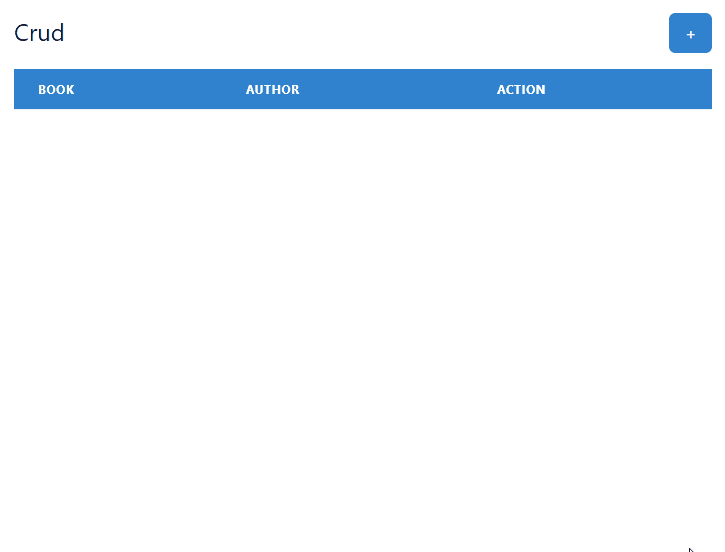

# A Books Plan-to-Read CRUD made with NextJS & MongoDB

You can check the app on the website: <a href="https://plan-to-read-booklist.vercel.app/">Plan-to-Read Books</a>



## 🚀 Technologies Used

  - Javascript
  - ReactJS 
  - NextJS
  - ChakraUI 
  - MongoDB
  - Jest
  - Babel
  - Axios
  
## ☕ Run
```shell
$ git clone https://github.com/beceluiz/plan-to-read-booklist.git
$ cd plan-to-read-booklist
```
Install all dependecies:
```
$ yarn install
```
Create a `.env.local` file and fill with:
```env
NEXT_PUBLIC_MONGO_URL= <your-mongo-url>
NEXT_PUBLIC_BASE_URL= http://localhost:<port>
```
## Contributing
If you want to contribute to a project and make it better, your help is very welcome.

- Fork this repo.
- Clone the forked repo in your local machine.
- Implement your fix/feature.
- Push your changes into the main repo and open a Pull Request.
